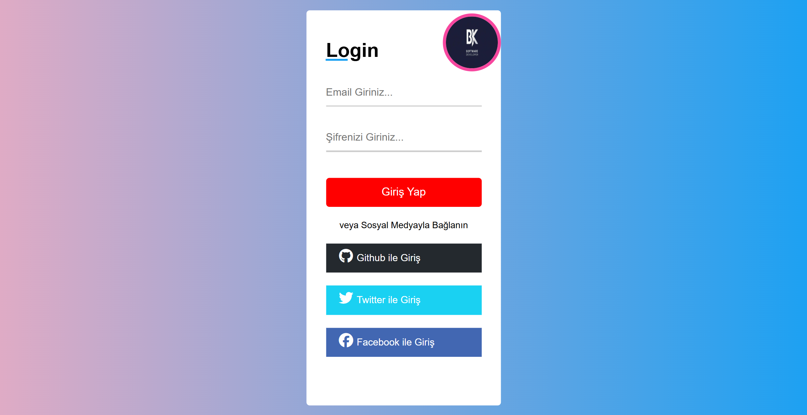
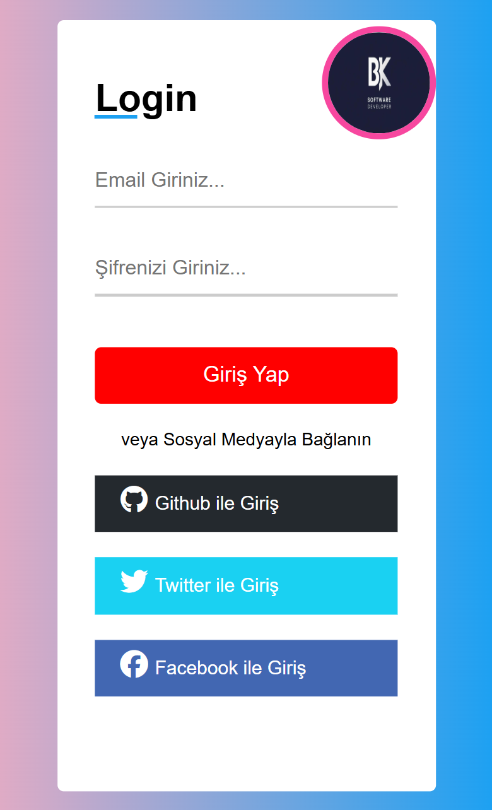
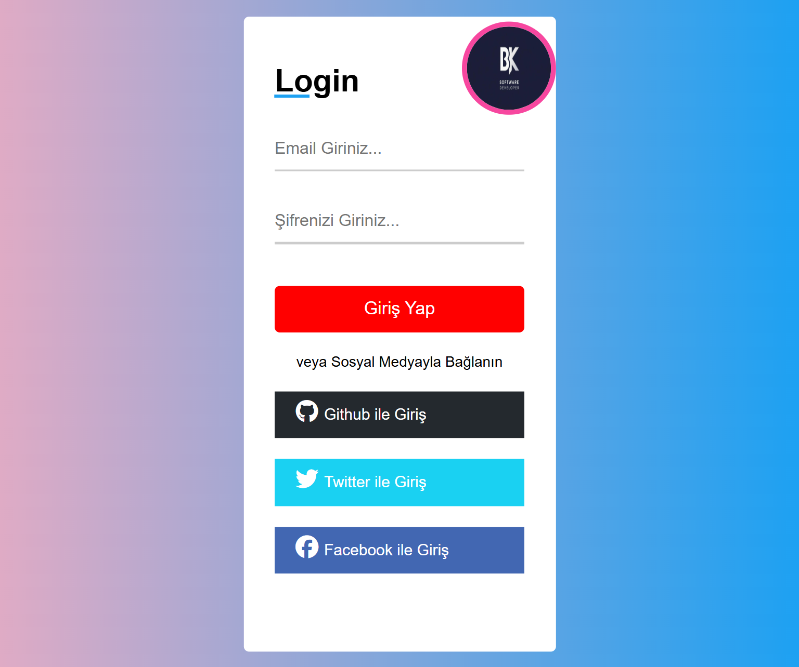

# login-page
A simple and responsive login page built with HTML and CSS, optimized for mobile, tablet, and laptop screens.

### 🖥️ Live Demo  
🔗 [View Site](https://bariskarakocdev.github.io/login-page/)

---

## 💻 Technologies Used
- **HTML5** – Structure of the page and form elements
- **CSS3** – Styling, gradient background, hover and animation effects
- **Font Awesome** – Social media icons (GitHub, Twitter, Facebook)
- **Flexbox & Grid** – Flexible and responsive layout for all devices
---

## 📱 Responsive Design Screenshots  

### 🖥️ Desktop View  

### 📱 Mobile View  

### 📲 Tablet View  

---

## 📁 Project Structure  

login-page/
├── images/
├── screenshots/
│ ├── laptop.png
│ ├── mobile.png
│ └── tablet.png
├── LICENSE
├── README.md
├── index.html
└── style.css

---

## 📝 License  
This project is licensed under the terms of the MIT License.

---

## ✍️ Developer  
[@bariskarakocdev](https://github.com/bariskarakocdev)
